# ReservationSystem
Reservation system for restaurant 

## App Walkthrough

- Home Screen contains 2 buttons: "Continue As Guest" and "Sign In/Register" 
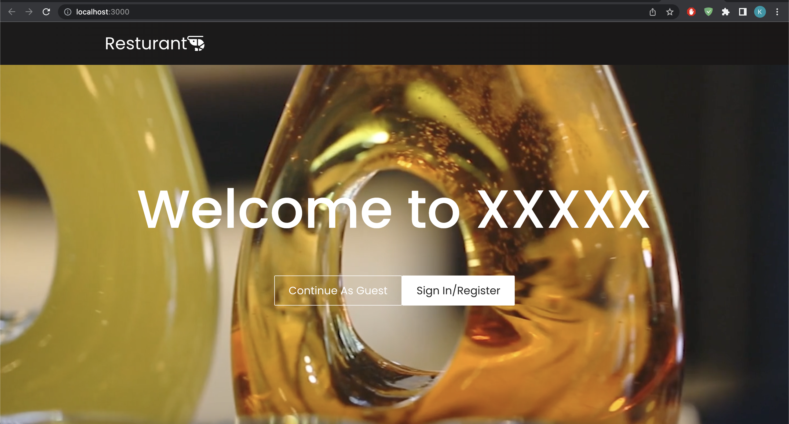 

- Registering for an account  
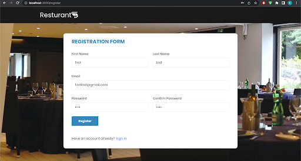 

- Successful account registered into the database  
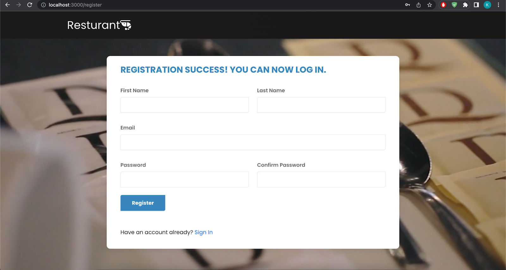 
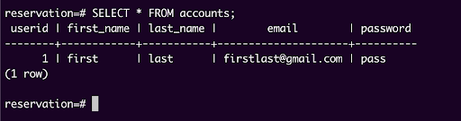 

- Register with an email that is already registered will give an error  
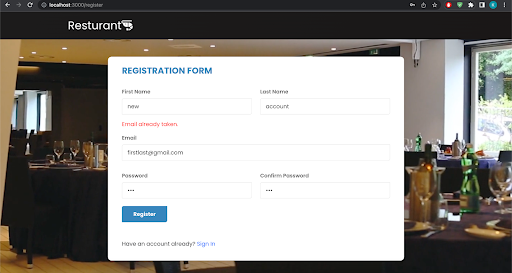 

- Signing in will take you to a personal Reservation Form that has the user's "first name" and "last name" on the form  
 

- The form for registered users will also have first name, last name, and email already pre-filled  
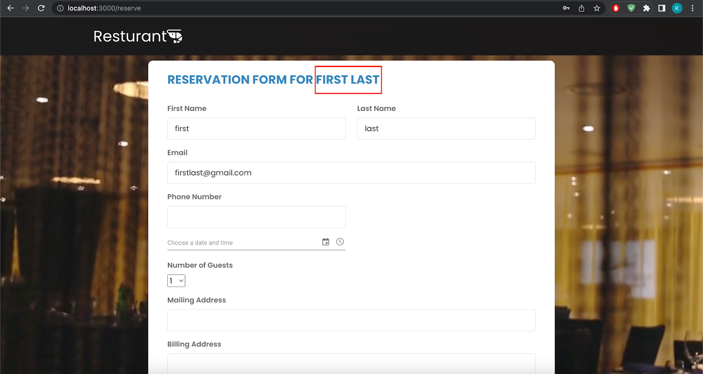 

- Filling in information  
- NOTE checkmark for same mailing and billing addresses  
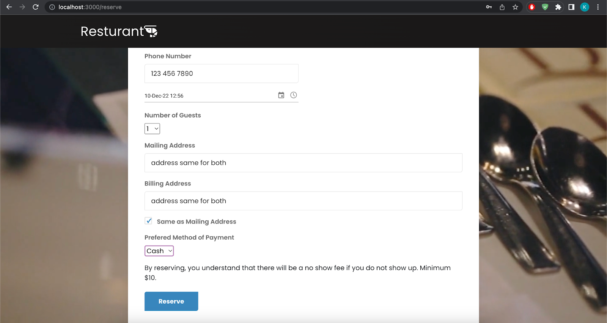 

- Succusful reservation will display "Reservation Successful for" followed by the user's first and last name 
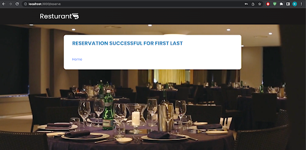 
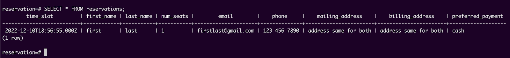 

- Guest reservation form will display "Reservation Form for Guest"  
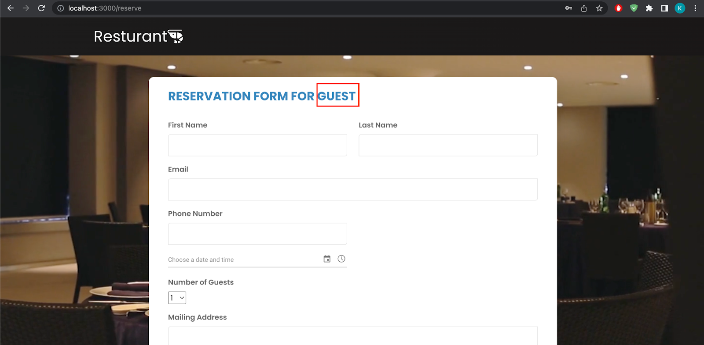 

- Filling out form demo  
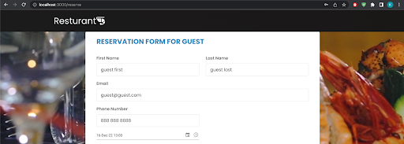 
- NOTE different mailing and billing addresses  
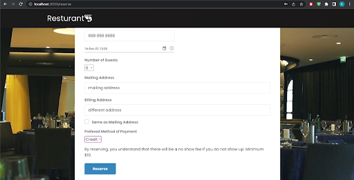 

- Succusful guest reservation will display "Reservation Successful for Guest:" followed by their first and last name  
 
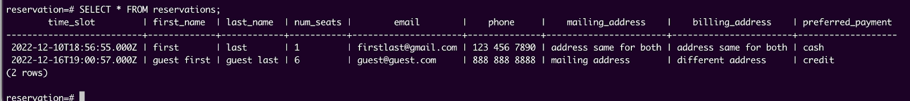 

- Creating new account  
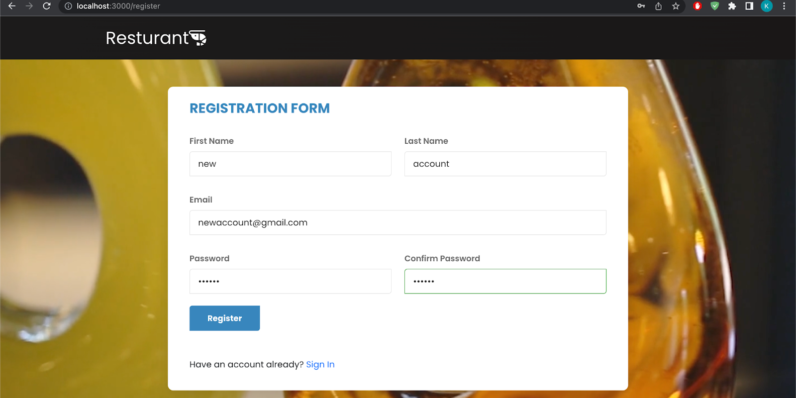 
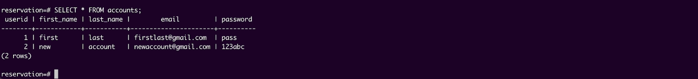 

- Other Error Handlings  
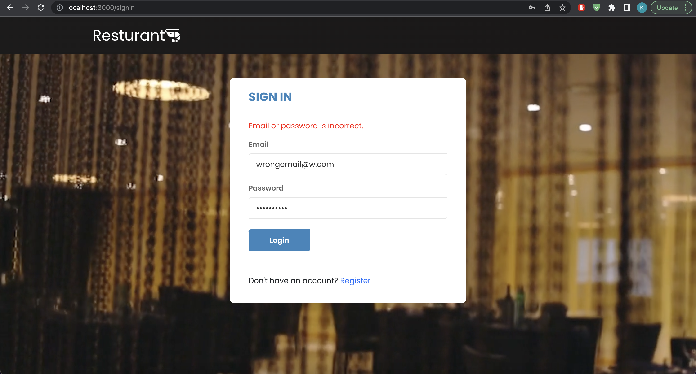 
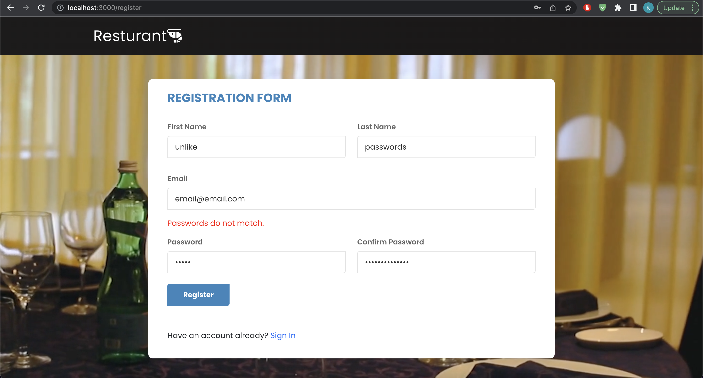 
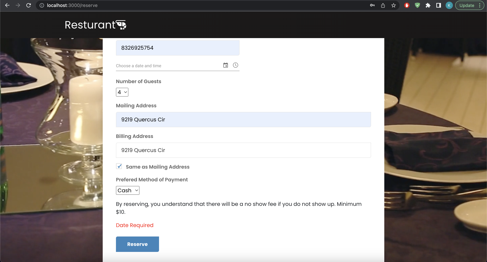 

